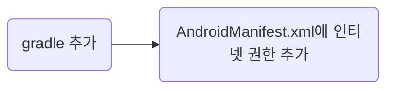
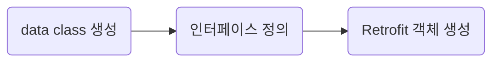

# 레트로핏(Retrofit)

## 목차
1. [Retrofit이란?](#retrofit이란)
2. [알고가면 좋은 기본 개념](#기본-개념)
3. [Retrofit 사용 전](#사용-전)
4. [Retorift 사용을 위한 단계](#사용을-위한-단계)
5. [http요청에 대한 응답](#http-요청과-응답)

## Retrofit이란?
- 서버와 클라이언트 간 http 통신을 위한 라이브러리.
- OkHttp 라이브러리를 기반으로 하고 있음.

서버 통신을 도와주는 라이브러리

- AsyncTask, HttpClient, Volley, OkHttp...
- OkHttp를 제외한 나머지는 Deprecreated 된 상태.

 

### 장점
- REST 기반의 웹 서비스를 통해 JSON 구조의 데이터를 쉽게 가져와 업로드 할 수 있다.
- AsyncTask와 비교했을 때, 가독성이 좋고 간편하게 사용할 수 있다.

 
 

## 기본 개념
1. [Request URL](#1-request-url)
2. [응답 형태](#2-응답-형태)
3. [GET / POST / PUT / PATCH / DELETE](#3-요청-형태-get--post--put--patch--delete)
4. [파라미터](#4-파라미터)

 

### 1. Request URL
> Retrofit은 안드로이드에서 **필요한 데이터를 서버로부터 가져오고, 서버에 특정 데이터를 전송할 때** 사용된다.  
그러면 '어떤 주소'로 요청을 보내야 할까?
 

### 2. 응답 형태
> 요청을 보냈을 때, 응답 값이 **Json 혹은 html** 일 것이다.

요청을 보내고자 하는 사이트가 어떠한 형태로 응답을 하는지 알아야 한다.
 

### 3. 요청 형태 (GET / POST / PUT / PATCH / DELETE)
어떤 데이터를 요청할 것이냐에 따라 방식이 달라진다. 단순히 정보 조회만 필요한 것이라면 데이터를 생성하는 요청방식은 필요 없을 것이다.
 
 

> 데이터 조회 및 생성
- GET : 데이터를 조회만 할 수 있다.
- POST : 서버에 데이터를 생성할 수 있다.

> 데이터 수정(업데이트)
- PUT : 서버 내 데이터를 업데이트 할 수 있다. 그러나 **데이터 전체 내용**이 덮여 쓰여진다.

- PATCH : PUT과 동일한 역할을 수행하지만, **데이터의 일부**만 업데이트 할 수 있다.

> 데이터 삭제
- DELETE : 서버 내 데이터를 삭제한다.
 

### 4. 파라미터
> 필수 파라미터가 무엇인지 알아야 한다.

 
 

## 사용 전

 

## 사용을 위한 단계

3가지 클래스
1. [Data class](#1-data-class)
2. [Interface](#2-interface)
3. [Object](#3-object)

### 1. Data class
Data class는 응답받을 리소스를 토대로 작성되어야 한다.

### 2. Interface
Interface는 원하는 요청 방식에 따라 작성해준다.

### 3. Object(<- Retrfofit 객체 생성)
다음은 Retrofit 객체 생성 단계이나, 매 서버 호출 시마다 객체 생성하는 것은 비효율적이므로 Object로 생성하였다.
 
 

## HTTP 요청과 응답
Retrofit에서는 execute(동기), enqueue(비동기)의 2가지 통신 메서드를 지원한다. 필자는 비동기 방식을 사용하였다.
 - 통신 성공 : onResponse()
 - 통신 실패 : onFailure()

실패한 경우 에러가 발생하기 때문에 **통신 성공 여부에 따른 처리 코드** 를 작성해주어야 한다.  
또한 **통신은 성공했으나 응답의 문제가 있을 경우** 에 대한 처리도 필요하다(response.isSuccessful 로 구분 가능).  

- 통신도 성공, 정상적으로 응답도 받았다면 response.body에 요청한 데이터가 들어온다.
- 에러가 발생했다면, 로그에 찍어보자.

## 참고
[블로그]
 - https://todaycode.tistory.com/38
 - https://velog.io/@jeongminji4490/Android-Retrofit